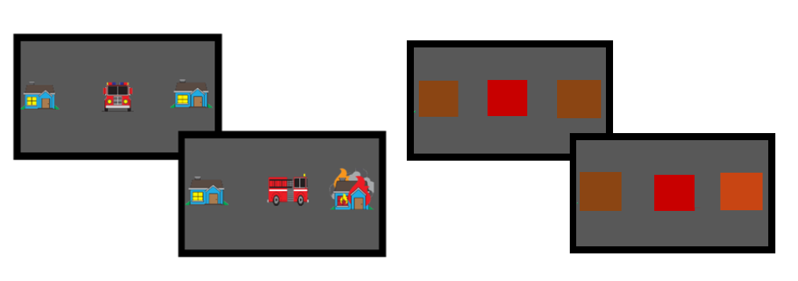

```{r setup, include=FALSE}
knitr::opts_chunk$set(echo = TRUE)
knitr::opts_knit$set(eval.after = 'fig.cap')
# library
library(tidyverse)
library(ggthemes)
```

```{r load in data, include = F, echo = F}
# load decision data 
load("scratch/data/df_Aberdeen_decisions")
# load demographics
load("scratch/data/df_Aberdeen_demographics")

```


```{r participant info, echo = F}
# total count 
Num_participants <- length(unique(df_Aberdeen_decisions$participant))

# age information
age_avg <- round(mean(df_Aberdeen_demographics$age), digits = 1)
age_max <- max(df_Aberdeen_demographics$age)
age_min <- min(df_Aberdeen_demographics$age)

# Number of females 
num_f <- df_Aberdeen_demographics %>% 
  group_by(gender) %>%
  summarise(n = n())
num_f <- num_f$n[num_f$gender == "female"]
```
# Participants 
Participants were collected through use of the level one practical classess at the University of Aberdeen in return for course credit. In total, `r Num_participants` took part in the experiment (`r num_f` were female) with and average age of `r age_avg` (minimum of `r age_min` and a maximum of `r age_max`).

# Procedure
1. Participants were assigned to one of two groups (examples of which can be seen below):
    + In the square group the avatar is a red square, and the two possible targets are two brown squares, one of which will turn orange to indicate it is the target on that trial. Participants are told to place the red square so it can reach the target (they do not know which is the target until they have placed the square) and the red square needs to reach the orange square before it turns black. 
    + In the truck group, the avatar is a firetruck, the two possible targets are houses, and flames appear on one of them (the target). The truck needs to reach the burning house before it turns into a charred ruin.


2. All participants will complete two blocks, one with a fixed speed, and one with a variable speed. Order of blocks is counterbalanced.  Each block consists of 3 different phases, run in this order:
    + Observation (40 trials): participants are familiarised with the avatar's movements (i.e. speed and variability)
    + Decision (60 trials): participants decide where to place the avatar 
    + Estimation (20 trials) To show they learned/noticed the avatar speed and variability, participants estimate the outcome for avatars placed at different distances from targets 
    
3. **Observation Phase**
    + The avatar and a single target will be displayed on screen.
    + 	There are 4 distances that the target can be placed away from the avatar.  Each distance is repeated 10 times, in order of increasing distance, so the participants are able to observe success rate at each distance.
    + There are three different levels of consistency for the avatar; each participant will only experience two of these (in separate, counterbalanced blocks): 
        +	Consistent: The avatar will always travel a certain distance with no variation
        +	Variable: The avatar's performance is pseudo-random. In the Pilot of this experiment, there were 9 different speeds that each had an equal chance of being the speed on each trial. For the current version, there will only be 7 different speeds, again each equally likely to be the selected speed on each trial.
        + All of these are specified so that optimal choices during the decision phase are very similar 

4. **Decision Phase**
    +	If this is the first block, participants will see a short demonstration of the task showing them what the decision phase will look like and explaining how to respond. 
    + Participants will be tasked with placing the avatar in a location, with the goal of reaching the target before the deadline (in the case of the squares, that is, before the square turns black and in the case of the trucks, before the house burns down). 
    + On each trial during the decision phase, there will be two possible targets present each of which is equally likely to become the target on that trial. 
    + Participants will choose the placement of the avatar by clicking with the mouse cursor somewhere between the two targets. 
    + Participants will then press the spacebar when they are happy with their placement. One of the two possible targets will become the target (i.e. a square turns orange or the house has fire added) and the avatar will move towards the target, at a speed determined by the condition.
        +	If successful, the target will return to its prior state
        +	If not, it will burn down (truck condition) or turn black (square condition)
    + There will be 15 trials for each distance meaning that participants will complete 60 trials in each decision phase
    + After completing this part, they will be told how many buildings they prevented burning down

5. **Estimate Phase**
    + In this part, participants will see the avatar and a target placed at some distance apart. 
    + They will be tasked with estimating the chance of success in one of two ways (participants are randomly assigned to one measure or the other):
        + *Frequency*: They will be asked "*How many times out of 10 do you think the truck/square would reach the target in time?*" and will respond by pressing the up or down keys to increase or decrease the initial starting value of 5.
        + *Confidence*: They will be asked "*Will the truck/square reach its target?*" and will be asked a respond by pressing the "y" key for Yes, and the "n" key for No. They will then be reminded how they answered and be asked "*How sure are you?*" which they will respond to by indicating on a visual analog scale ranging from "Not sure at all" to "Definitely Sure". 

6. At the end, they will fill out a short questionnaire to indicate three outside interests or  hobbies, and answer one randomly-selected question from the Cognitive Reflection Test. 

# Plotting Results
```{r plts, fig.cap = cap, echo = F, fig.align= "center"}
df_Aberdeen_decisions$Norm_Delta <- df_Aberdeen_decisions$delta/max(df_Aberdeen_decisions$delta)

# sort out dist_type column
df_Aberdeen_decisions$dist_type <- "close"
df_Aberdeen_decisions$dist_type[df_Aberdeen_decisions$Norm_Delta > 0.5] <- "far"

# Make the plot
plt_dist_dec <- df_Aberdeen_decisions %>% 
  mutate(abs_pos = abs(placed_x)/delta) %>%
  group_by(participant, dist_type, truck_perf, condition_label) %>%
  summarise(pos = mean(abs_pos)) %>%
  ungroup() %>%
  ggplot(aes(pos, 
             colour = truck_perf,
             fill = truck_perf)) + 
  geom_density(alpha = 0.3) + 
  facet_grid(condition_label~dist_type)
plt_dist_dec$labels$x <- "Normalised Placement"
plt_dist_dec$labels$colour <- "Condition"
plt_dist_dec$labels$fill <- "Condition"
plt_dist_dec

cap <- "Distribution of Normalised Avatat placements for different conditions and speed types"


```


